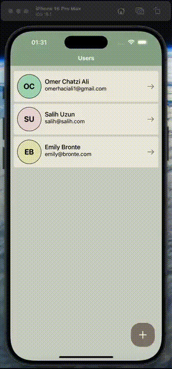

# UserList - React Native Redux Toolkit

This user list app built with React Native uses Redux Toolkit for global state management, Formik and Yup for form validation. New users can be added, existing users can be updated and deleted in the app.

## Technologies and Libraries Used

- react
- react-native
- @react-navigation/native
- @react-navigation/native-stack
- @reduxjs/toolkit
- react-redux
- formik
- yup
- iconsax-react-native
- react-native-screens
- react-native-svg
- react-native-safe-area-context

## GIF

# UserList-ReactNative-Redux-Toolkit
# UserList-ReactNative-Redux-Toolkit
